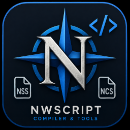
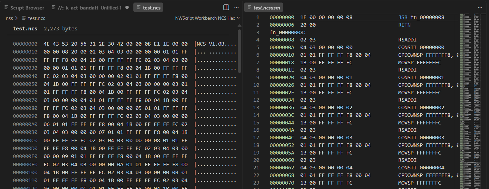

# NWScript Workbench

Complete NWScript development tools for **VS Code Desktop** and **VS Code for the Web** (`vscode.dev`, `github.dev`, Codespaces web editor).

The extension uses [`KobaltBlu/nwscript-wasm`](https://github.com/KobaltBlu/nwscript-wasm/tree/master), which packages the native NWScript compiler as WebAssembly. The compiler JavaScript is bundled into the extension and the `.wasm` binary is shipped inside the VSIX, so **no native compiler, Nim, Python, Emscripten, or network access is required at runtime**.

## Highlights

- Compile `.nss` to `.ncs` entirely through WebAssembly on desktop and in the browser
- Workbench Home for workspace status, language-spec resolution, and compile controls
- Script Browser and Language Definition Browser for vanilla KOTOR/TSL sources and `nwscript.nss` catalogs
- Engine-aware IntelliSense, navigation, snippets, and diagnostics from the active language specification
- Read-only NCS Inspector, textual disassembly, and two-file NCS compare
- Basic NWScript and NCS assembly syntax highlighting
- Virtual-workspace friendly: uses only VS Code URI / `workspace.fs` APIs

## Quick start

1. Install **NWScript Workbench** from the Marketplace (or load a local VSIX).
2. Open a workspace that contains your scripts and an `nwscript.nss` language specification.
3. Run **NWScript Workbench: Open Home**, or compile with **NWScript Workbench: Compile Current File**.

For multi-game workspaces, put each game in its own folder with its own `nwscript.nss`. See [Getting started](docs/getting-started.md) and [Language specifications](docs/language-specifications.md).

## Requirements

- VS Code `^1.100.0` or a compatible editor/host (Desktop, `vscode.dev`, `github.dev`, Codespaces web)
- Internet connection only when using the Script Browser or Language Definition Browser

## Documentation

| Topic | Description |
| --- | --- |
| [Getting started](docs/getting-started.md) | Home, Script Browser, first compile, recommended layouts |
| [Language specifications](docs/language-specifications.md) | How `nwscript.nss` is resolved; Language Definition Browser |
| [Commands](docs/commands.md) | Command palette reference and compile output |
| [Configuration](docs/configuration.md) | Settings reference |
| [NCS Inspector](docs/ncs-inspector.md) | Binary inspection, disassembly, and compare |
| [Editor](docs/editor.md) | IntelliSense and VS Code navigation |
| [Web and virtual workspaces](docs/web-and-virtual-workspaces.md) | Browser hosts and virtual FS tips |
| [Architecture](docs/architecture.md) | Extension host and WASM packaging |
| [Development](docs/development.md) | Build, run, package, and update the compiler |

## Licensing

The extension source is distributed under GPL-3.0-only because the packaged extension includes the linked NWScript compiler WebAssembly artifact, which is subject to the upstream compiler's GPL-3.0 licensing.

See [THIRD_PARTY_NOTICES.md](THIRD_PARTY_NOTICES.md) for the upstream compiler dependency.

## Support

See [SUPPORT.md](SUPPORT.md) for bug reports and feature requests.
