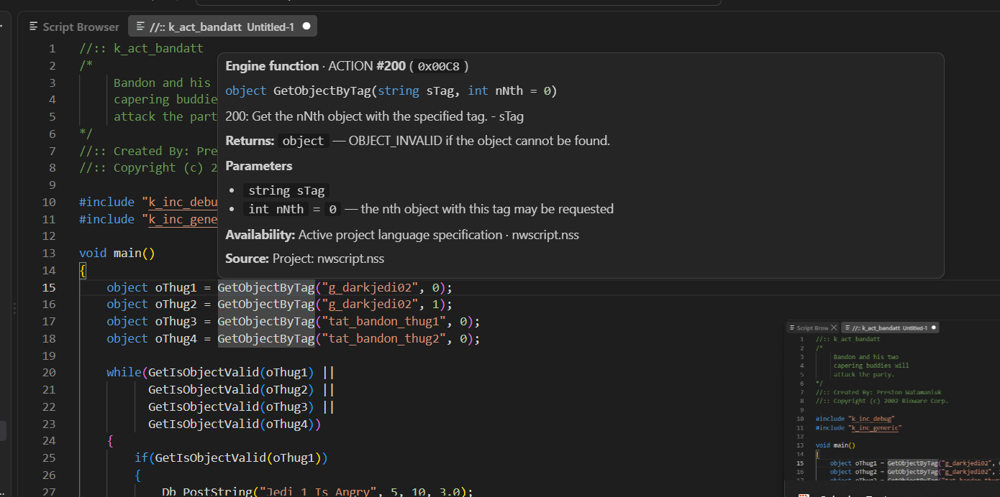

# Editor

## Engine-aware IntelliSense

The extension builds IntelliSense directly from the automatically resolved `nwscript.nss` language specification. Project specifications are parsed into a cached engine API model, so moving between game trees changes the editor API without rebuilding the extension.

The NWScript editor provides:

- engine function completions with parameter and return-type metadata
- engine constants and global symbols from the active language specification
- snippet-style function insertion with parameter placeholders
- signature help on `(` and `,`, including defaults and active-argument highlighting
- multiple signatures when the active specification declares the same function name more than once
- rich hover cards with the declaration, return type, parameter documentation, engine ACTION ID, active-spec availability, and curated NWScript notes for selected APIs

ACTION IDs are derived from function declaration order in the active `nwscript.nss`, matching the engine command table represented by the language specification.

Language specifications must be accessible in the workspace so compilation and editor intelligence resolve the same API for each script. See [Language specifications](language-specifications.md).

The extension also contributes basic NWScript and NCS assembly syntax highlighting.

Optional editor extras (inlay hints, semantic tokens, formatting, folding, code actions) are described in [Configuration](configuration.md).

## Native VS Code navigation

NWScript symbols participate in VS Code's normal language-navigation workflow. The extension resolves symbols using the same translation-unit model as IntelliSense: declarations in the current script take precedence over recursively included NSS files, which take precedence over the active `nwscript.nss` engine API.

Supported editor features include:

- Go to Definition and Peek Definition for script, include, and engine symbols
- Go to Declaration using the same NWScript symbol resolution
- Find All References across NSS files that actually see the same declaration through their include/spec scope
- Rename Symbol for user script/include symbols; engine API symbols are intentionally read-only
- Document Highlights for the active symbol
- Outline / Go to Symbol in Editor for top-level functions, constants, and globals
- Go to Symbol in Workspace across NSS files
- clickable `#include` resource links and Go to Definition on include resrefs

Reference and rename searches ignore comments and string literals and validate each candidate NSS file against its resolved translation-unit symbol model instead of performing a blind workspace text replacement.
