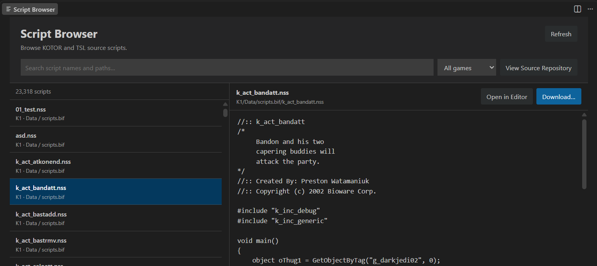

# Getting started

## Workbench Home

Run **NWScript Workbench: Open Home** to open the extension control center in an editor tab.

Home provides:

- an Activity Bar sidebar entry that opens Home and links to the Script and Language Definition browsers
- current workspace and active language-specification status
- a workspace-wide language-definition resolution list (coverage, active/shadowed/isolated states, conflicts, and removal actions)
- ACTION signature compatibility warnings when multiple workspace `nwscript.nss` files disagree
- script-scoped language-specification resolution and conflict controls
- inline controls for compile-on-save, optimization, and NDB output
- summaries of include/output configuration
- include graph for the active NSS
- recommended workspace layouts and offline help
- links to the extension and compiler repositories

Home opens automatically once a workspace is loaded after the extension activates (`nwscript.autoOpenHome`, default on). Turn that setting off to opt out. Home remains available from the Activity Bar, Command Palette, and editor title actions.

See [Language specifications](language-specifications.md) for how `nwscript.nss` is resolved.

## Script Browser

Run **NWScript Workbench: Browse Scripts** to search the decompiled KOTOR and TSL source catalog maintained by [KOTOR Community Patches](https://github.com/KOTORCommunityPatches/Vanilla_KOTOR_Script_Source).

The browser fetches the repository catalog from GitHub. Search operates locally over script names and repository paths; selecting a result fetches only that script for preview. You can open a source copy in an untitled NWScript editor or download it through VS Code's URI-aware save dialog into a desktop, browser, or virtual workspace.



No upstream script source is packaged with NWScript Workbench. An internet connection is required, and downloaded sources remain subject to the upstream repository and game-content terms.

## First compile

1. Ensure an `nwscript.nss` is discoverable for the script you are editing (workspace root, nearest ancestor, or a single project specification). See [Language specifications](language-specifications.md).
2. Open a `.nss` entry script (`void main` / `int StartingConditional`).
3. Run **NWScript Workbench: Compile Current File**.

By default, output is written beside the source:

```text
script.nss
script.ncs
```

If NDB generation is enabled, `script.ndb` is written as well. Progress and errors appear in **View → Output → NWScript Compiler** and in the Problems panel. See [Commands](commands.md) and [Configuration](configuration.md).

## Recommended multi-game layout

For projects that contain scripts for multiple games, place each game in its own subfolder with its own `nwscript.nss` rather than putting a shared specification at the workspace root:

```text
My NWScript Workspace/
├─ kotor1/
│  ├─ nwscript.nss
│  ├─ includes/
│  └─ scripts/
│     └─ k1_script.nss
│
├─ kotor2/
│  ├─ nwscript.nss
│  ├─ includes/
│  └─ scripts/
│     └─ k2_script.nss
│
└─ custom-game/
   ├─ nwscript.nss
   └─ scripts/
      └─ custom_script.nss
```

With this layout, scripts under `kotor1/` resolve against `kotor1/nwscript.nss`, scripts under `kotor2/` resolve against `kotor2/nwscript.nss`, and custom projects can provide their own language specification independently.
